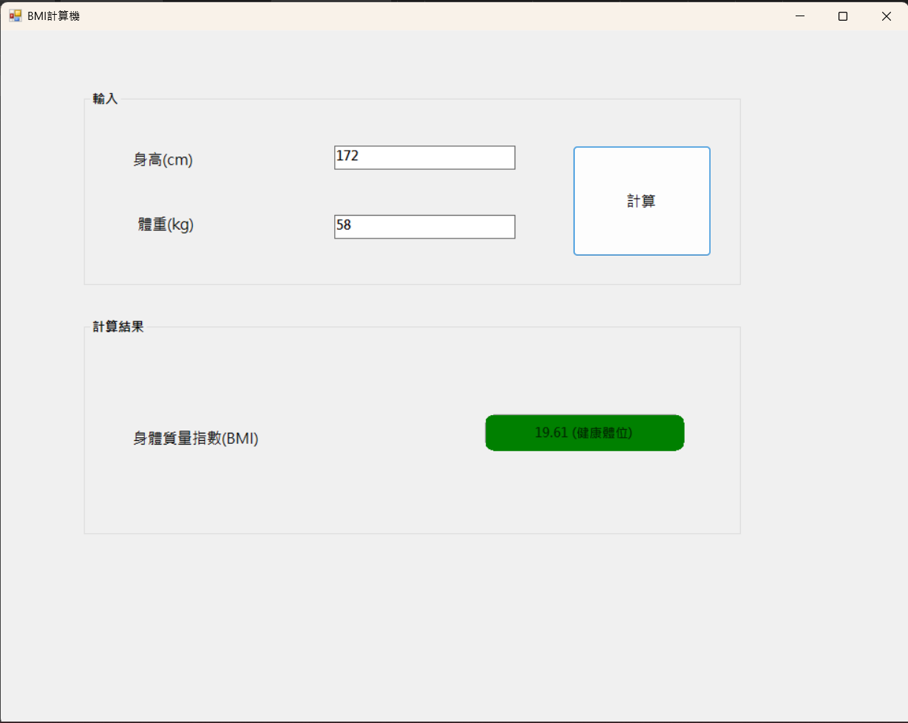

# BMI計算機1133334

## BMI Calculator (WinForms)
A modern, desktop-based BMI (Body Mass Index) Calculator built using C# and Windows Forms. This application provides a user-friendly interface to calculate health metrics with real-time UI feedback based on the results.

## Features
**BMI Calculation**: Accurate calculation using the standard metric formula:`BMI = Weight (kg) ÷ [Height (m)]²`

**Modern UI Styling**:Utilizes Windows API (Gdi32.dll) to create smooth, rounded corners for UI elements.

**Dynamic Visual Feedback**:

1.Automatically classifies results into Underweight, Healthy, Overweight, and various Obesity levels.

2.The result background color changes based on the health category.

3.Automatically adjusts text color (Black or White) based on the background's brightness to ensure readability.

## Screenshots

